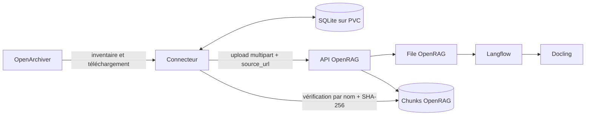

# Connecteur OpenArchiver → OpenRAG

Ce service inventorie les mails archivés dans OpenArchiver et délègue leur
indexation à OpenRAG. Il ne contient ni moteur OCR, ni parser documentaire, ni
base vectorielle : ces responsabilités restent dans OpenRAG, Langflow et
Docling.

Le connecteur est un orchestrateur avec une mémoire locale : il sait ce qui a
été découvert, sélectionné, soumis, validé ou perdu. Cette mémoire est une base
SQLite conservée sur le PVC `openrag-openarchiver-connector-state`.

## Vue d'ensemble



Le chemin nominal d'un objet est le suivant :

1. l'inventaire crée une ligne `queued` dans SQLite ;
2. un thread la réserve atomiquement et la passe à `downloading` ;
3. le fichier original est téléchargé depuis OpenArchiver et son SHA-256 est
   calculé ;
4. la ligne passe à `ingesting`, puis le fichier est soumis à OpenRAG ;
5. le connecteur interroge la tâche OpenRAG toutes les 250 ms ;
6. après `completed`, il exige une connaissance ayant au moins un chunk et un
   `document_id` correspondant au SHA-256 local ;
7. la ligne passe seulement alors à `validated`.

Ainsi, une réponse HTTP d'acceptation ou même une tâche OpenRAG `completed` ne
suffit pas à déclarer le fichier indexé.

## Où commencer dans le code

Le service tient dans un seul module Python afin de pouvoir être injecté par
une ConfigMap sans construire une image spécifique. Les séparateurs dans
`connector.py` permettent de le lire dans cet ordre :

1. `Config` : lecture et validation des variables d'environnement ;
2. `connect_db` : schéma SQLite et migrations ;
3. `OpenArchiverClient` et `scan_selected_sources` : inventaire ;
4. `mail_openrag_filename` et `attachment_openrag_filename` : noms visibles ;
5. `OpenRAGClient` et `wait_for_indexed_document` : soumission et validation ;
6. `claim_next`, `process_work_item` et `process_queue` : file locale ;
7. `RuntimeState`, `run_cycle` et les trois boucles de fond ;
8. `OpenRAGAuthClient` : délégation du login, session et permissions à OpenRAG ;
9. `make_http_handler` : interface, API d'état et actions ;
10. `main` : assemblage du processus.

Les fonctions `parse_eml` et `render_mail_markdown` sont des utilitaires testés,
mais ne sont pas sur le chemin d'ingestion actuel : OpenRAG reçoit le `.eml`
original.

## Authentification synchronisée avec OpenRAG

Le connecteur n'a pas son propre annuaire et ne signe aucun token. En
`OPENRAG_AUTH_MODE=auto`, il demande à `/auth/me` quel mode OpenRAG utilise :

- si OpenRAG répond `no_auth_mode=true`, l'interface reste accessible comme
  aujourd'hui ;
- si OpenRAG exige une session, le connecteur affiche le même parcours
  **Continuer avec Google** et refuse ses routes fonctionnelles sans session ;
- si OpenRAG est indisponible, le connecteur échoue fermé avec une erreur 503
  au lieu de contourner l'authentification.

Le parcours OAuth reste entièrement piloté par OpenRAG :

1. `POST /auth/login` demande à OpenRAG d'initialiser `purpose=app_auth` ;
2. le navigateur est redirigé vers l'URL Google retournée par OpenRAG ;
3. Google revient sur `/auth/callback` avec le code et le `state` ;
4. le connecteur transmet ce retour à OpenRAG ;
5. OpenRAG échange le code, crée l'utilisateur et signe son JWT ;
6. le connecteur recopie ce JWT dans un cookie `Secure`, `HttpOnly`,
   `SameSite=Lax` limité à son propre domaine ;
7. à chaque requête protégée, `/auth/me` puis `/users/me` restent les sources
   de vérité pour l'identité, les rôles et les permissions.

Le JWT n'est jamais stocké dans SQLite. La table `users` ne conserve que
l'identifiant opaque OpenRAG, le fournisseur, les rôles, les permissions et
les dates de présence ; elle ne conserve ni nom ni adresse e-mail. La table
`audit_log` attribue les mutations globales (scan, pause, reset, changement de
sélection ou de secret) à cet identifiant.

Lorsque le RBAC OpenRAG est actif, les actions partagées sensibles (`secrets`,
sélections, pause et reset) demandent `config:write`. Le scan, la
réconciliation et la réindexation demandent `knowledge:upload`. Lorsque le
RBAC est désactivé, le connecteur reproduit le coupe-circuit OpenRAG et laisse
les utilisateurs authentifiés agir.

### Limite volontaire de cette première étape

L'identité, les permissions et l'audit sont multi-utilisateurs, mais
l'inventaire, les sélections et la file existants restent encore un espace
d'exploitation partagé. L'interface l'indique explicitement. L'ingestion
continue donc d'utiliser la clé API de service actuelle.

La séparation complète demandera une table de travaux par
`(openrag_user_id, type, object_id)` et une clé API OpenRAG appartenant à chaque
utilisateur. Ce découpage ne doit pas être simulé en ajoutant simplement un
`user_id` aux mails : un même mail peut légitimement être indexé par plusieurs
utilisateurs avec des états et des tâches OpenRAG différents.

Pour activer ultérieurement Google OAuth dans OpenRAG, les deux URI doivent
être autorisées dans le client Google :

```text
https://openrag.ferme-de-pommerieux.fr/auth/callback
https://openrag-openarchiver-connector.ferme-de-pommerieux.fr/auth/callback
```

Les identifiants OAuth restent configurés uniquement dans OpenRAG ; le
connecteur ne les reçoit pas.

## Inventaire et sélection

L'inventaire suit deux niveaux de sélection : une source OpenArchiver, puis un
ou plusieurs dossiers de cette source. Seuls les mails appartenant aux deux
niveaux sélectionnés peuvent être réservés par la file.

Au premier démarrage sans inventaire, le connecteur lit automatiquement les
sources et les mails. Ensuite, les cycles réutilisent le dernier inventaire
complet. Le bouton **Scanner** force une nouvelle lecture d'OpenArchiver. Si la
pagination d'un scan est invalide, le dernier instantané valide est conservé ;
un scan incomplet ne supprime donc rien et ne bloque pas une file déjà connue.

Les pièces jointes sont découvertes paresseusement : le détail d'un mail n'est
demandé que lorsque ce mail est réservé et indique qu'il contient des pièces
jointes. Une extension non prise en charge ou un fichier dépassant
`MAX_FILE_BYTES` devient `non_indexable`.

## États persistés

Les tables `emails` et `attachments` utilisent la même machine à états :

| État | Signification | Suite normale |
| --- | --- | --- |
| `queued` | Prêt à être réservé | `downloading` |
| `downloading` | Téléchargement OpenArchiver en cours | `ingesting` |
| `ingesting` | Tâche OpenRAG soumise ou attendue | `validated`, `failed` ou `lost` |
| `validated` | Des chunks correspondant au SHA-256 sont visibles | terminal jusqu'à modification/réconciliation |
| `failed` | Erreur de téléchargement, soumission, parsing ou timeout | retry automatique borné ou réindexation manuelle |
| `lost` | Tâche disparue ou connaissance absente/obsolète | retry automatique borné ou réindexation manuelle |
| `non_indexable` | Pièce jointe volontairement ignorée | terminal |
| `discovered` | État historique/de transition du schéma | normalement converti en `queued` à l'insertion |
| `missing`, `unavailable` | États historiques conservés pour compatibilité | remis en `queued` si l'objet réapparaît |

`attempts` compte les réservations de l'objet. Après un échec, `next_retry_at`
applique un délai exponentiel borné par `RETRY_MAX_SECONDS`. Une fois
`MAX_AUTO_RETRIES` atteint, l'objet reste visible dans l'onglet correspondant
et attend une sélection manuelle pour être réindexé.

## Noms des connaissances

Les noms sont lisibles, compatibles avec le multipart OpenRAG, limités à
255 caractères et protégés des collisions par un suffixe stable de 12
caractères :

```text
<objet-du-mail>--<id-mail-court>.eml
<objet-du-mail>--<id-mail-court>--<nom-piece-jointe>--<id-piece-court>.<ext>
```

Exemples :

```text
Suppression-de-vos-annonces-sur-leboncoin.fr--01760ab2cfcb.eml
Re-Convention-Isaure--00505f170ecb--annexes-convention--960f5ecc42ff.pdf
```

Les accents sont translittérés et les caractères non sûrs sont remplacés par
des tirets. L'UUID complet reste la clé locale ; le suffixe court ne sert qu'au
nom visible.

La version 3 du schéma a introduit ces noms. Sa migration recalcule les noms,
efface les anciennes preuves SHA/task et remet les objets indexables en file.
OpenRAG reçoit `replace_duplicates=true`, ce qui met progressivement à jour les
connaissances avec les noms lisibles.

## Concurrence et capacité Docling

`process_queue` crée un pool de threads. Chaque thread réserve et traite un seul
objet à la fois, puis réclame le suivant. Il n'existe volontairement aucune
sérialisation selon la taille du document ou la présence supposée d'OCR.

Avec `INGESTION_CONCURRENCY=auto`, la concurrence vaut :

```text
min(workers_Docling_détectés × INGESTION_PREFETCH_PER_WORKER,
    INGESTION_CONCURRENCY_MAX)
```

La détection lit la métrique Prometheus `rq_workers` de la file Docling
configurée. Si elle échoue, `INGESTION_CONCURRENCY_FALLBACK` est utilisé. Si la
détection réussit mais trouve zéro worker, aucune nouvelle ingestion n'est
soumise pendant ce cycle.

Cette concurrence limite les objets suivis simultanément par le connecteur.
Elle ne garantit pas que Langflow ou Docling les exécutent immédiatement :
OpenRAG conserve sa propre file en aval.

## Reprises et réconciliation

Au redémarrage, les lignes restées `downloading` ou `ingesting` deviennent
`failed` avec une prochaine tentative, si la limite n'est pas atteinte. Les
tâches déjà en vol peuvent donc finir côté OpenRAG, mais le connecteur ne les
considère plus comme certaines et les resoumettra avec remplacement des
doublons.

La **réconciliation** est un audit manuel déclenché depuis l'interface. Elle
prend les objets sélectionnés en `validated`, `failed` ou `lost` qui possèdent
un SHA-256, interroge `/v2/files` par lots de 100, puis :

- restaure en `validated` un objet `failed`/`lost` dont les bons chunks existent ;
- passe en `lost` un objet `validated` absent ou dont le `document_id` ne
  correspond plus ;
- réveille la file lorsqu'elle a découvert des objets perdus.

La réconciliation ne supprime jamais de document OpenRAG. Le bouton
**Réindexer la sélection** remet explicitement les lignes `failed`/`lost` en
`queued` avec leur compteur de tentatives à zéro.

## Pause, reset et arrêt

- **Pause** empêche uniquement de nouvelles réservations. Les objets déjà en
  cours terminent leur tentative.
- **Reprendre** réveille immédiatement le cycle.
- **Reset** attend la fin des quelques objets déjà réservés, vide l'état
  fonctionnel SQLite et laisse le connecteur en pause.
- `SIGTERM`/`SIGINT` réveillent les threads, ferment le serveur et laissent les
  opérations en cours être récupérées au prochain démarrage.

Ni la pause ni le reset ne suppriment de mails OpenArchiver ou de connaissances
OpenRAG.

## Processus et interface HTTP

`main` démarre quatre activités dans un seul pod :

| Activité | Rôle |
| --- | --- |
| `openarchiver-cycle` | inventaire, file locale et ingestion |
| `openarchiver-reconciliation` | audit demandé depuis l'interface |
| `openrag-queue-monitor` | état des tâches du connecteur et mails validés/minute |
| serveur HTTP | interface, événements SSE, probes et métriques |

Routes de lecture :

| Route | Usage |
| --- | --- |
| `/` | interface d'exploitation |
| `/status.json` | état courant sérialisé |
| `/events` | mises à jour SSE à chaque changement, keepalive à 15 s |
| `/metrics` | métriques Prometheus |
| `/healthz`, `/readyz` | probes Kubernetes |
| `/inventory-status` | fragment d'état de l'inventaire |

Actions POST : `/sources`, `/mailboxes`, `/scan`, `/pause`, `/retry`,
`/reconcile`, `/reset` et `/secrets`. Elles exigent toutes le jeton CSRF de la
page. Les clés saisies sont écrites atomiquement dans `/state/secrets`, jamais
enregistrées dans SQLite ni écrites dans les logs.

## Configuration de production

Les valeurs actives sont définies dans `deployment.yaml`. Les principales sont :

| Variable | Valeur actuelle | Rôle |
| --- | --- | --- |
| `OPENARCHIVER_BASE_URL` | service interne OpenArchiver `/v1` | API source |
| `OPENRAG_BASE_URL` | service interne `openrag-backend:8000` | API cible |
| `OPENRAG_AUTH_MODE` | `auto` | suit automatiquement le mode de login OpenRAG |
| `CONNECTOR_PUBLIC_URL` | URL HTTPS du connecteur | callback OAuth validé |
| `OPENRAG_INGEST_MODE` | `api` | upload multipart authentifié |
| `OPENRAG_UPLOAD_PATH` | `/v1/documents/ingest` | soumission |
| `OPENRAG_TASK_PATH` | `/v1/tasks/{task_id}/enhanced` | suivi de tâche |
| `STATE_DB` | `/state/connector.sqlite3` | état persistant |
| `SCAN_INTERVAL_SECONDS` | `3600` | délai entre les cycles |
| `TASK_TIMEOUT_SECONDS` | `3600` | attente maximale d'une tâche |
| `OPENARCHIVER_REQUESTS_PER_MINUTE` | `180` | limite partagée des appels source |
| `MAX_AUTO_RETRIES` | `3` | tentatives automatiques par objet |
| `RETRY_BASE_SECONDS` / `RETRY_MAX_SECONDS` | `300` / `3600` | backoff |
| `MAX_FILE_BYTES` | `104857600` | limite à 100 Mio |
| `INGESTION_CONCURRENCY` | `auto` | détection Docling |
| `INGESTION_CONCURRENCY_FALLBACK` | `2` | repli si métriques indisponibles |
| `INGESTION_CONCURRENCY_MAX` | `4` | borne du pool local |
| `INGESTION_PREFETCH_PER_WORKER` | `2` | objets en vol par worker détecté |
| `DOCLING_RQ_QUEUE_NAME` | `convert` | file comptée dans les métriques |
| `REQUEST_TIMEOUT_SECONDS` | `30` | timeout des appels HTTP courts |

Les extensions acceptées par défaut sont `.asc`, `.asciidoc`, `.adoc`, `.csv`,
`.docx`, `.htm`, `.html`, `.md`, `.pdf`, `.txt` et `.xlsx`. Elles peuvent être
remplacées par `SUPPORTED_EXTENSIONS`.

Les URL d'API doivent rester des URL HTTP internes sans identifiants. Les clés
sont lues depuis `OPENARCHIVER_API_KEY_FILE` et `OPENRAG_API_KEY_FILE`.

## Fichiers Kubernetes

| Fichier | Rôle |
| --- | --- |
| `connector.py` | application complète |
| `deployment.yaml` | pod, configuration, probes, volumes et limites |
| `pvc.yaml` | PVC SQLite et secrets persistés |
| `service.yaml` | Service ClusterIP HTTP |
| `ingress-http.yaml`, `ingress-https.yaml` | exposition Traefik |
| `middleware-*.yaml` | redirection et en-têtes HTTP |
| `kustomization.yaml` | assemble les ressources et génère la ConfigMap du code |
| `tests/test_connector.py` | tests unitaires et contrats Kubernetes |

Tout changement de `connector.py` modifie le hash de la ConfigMap générée et
provoque donc un redémarrage du pod lors de la réconciliation Fleet. Un simple
changement de ce README ne redémarre pas le service.

## Tester et diagnostiquer

Depuis ce dossier :

```bash
PYTHONPYCACHEPREFIX=/private/tmp/openarchiver-pycache \
  python3 -m py_compile connector.py
PYTHONPYCACHEPREFIX=/private/tmp/openarchiver-pycache \
  python3 -m unittest discover -s tests
```

Points de contrôle utiles dans le cluster :

```bash
kubectl -n openrag get pods
kubectl -n openrag logs deployment/openrag-openarchiver-connector --tail=200
kubectl -n openrag get deployment openrag-openarchiver-connector
```

Pour diagnostiquer une ingestion lente, regarder dans cet ordre :

1. le nombre d'objets `downloading`/`ingesting` et la concurrence effective ;
2. le débit **mails traités par minute** ;
3. les tâches OpenRAG `pending`/`running` du connecteur ;
4. la file et la charge Langflow ;
5. la file RQ, la mémoire et la température des workers Docling.

## Invariants à préserver lors d'une modification

- Ne jamais passer à `validated` sans tâche terminée **et** chunks correspondant
  au SHA-256.
- Réserver une ligne dans une transaction SQLite avant tout téléchargement.
- Ne jamais supprimer automatiquement de connaissance OpenRAG pendant une
  réconciliation ou un reset local.
- Ne jamais journaliser une clé, un corps de mail ou le contenu d'une pièce
  jointe.
- Borner les réponses, sélections, lots, noms et tailles provenant des API.
- Incrémenter `SCHEMA_VERSION` pour toute migration de données ou de schéma et
  rendre cette migration rejouable sans danger.
- Conserver les actions POST protégées par le jeton CSRF.
- Ne jamais décoder un JWT sans le faire revalider par OpenRAG, ni le stocker
  dans SQLite ou dans les logs.
- Ne pas présenter l'espace d'exploitation partagé actuel comme une isolation
  multi-utilisateur des connaissances.
- Tester les transitions heureuses, les reprises et les réponses API invalides.
